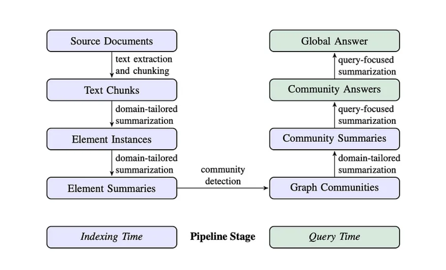
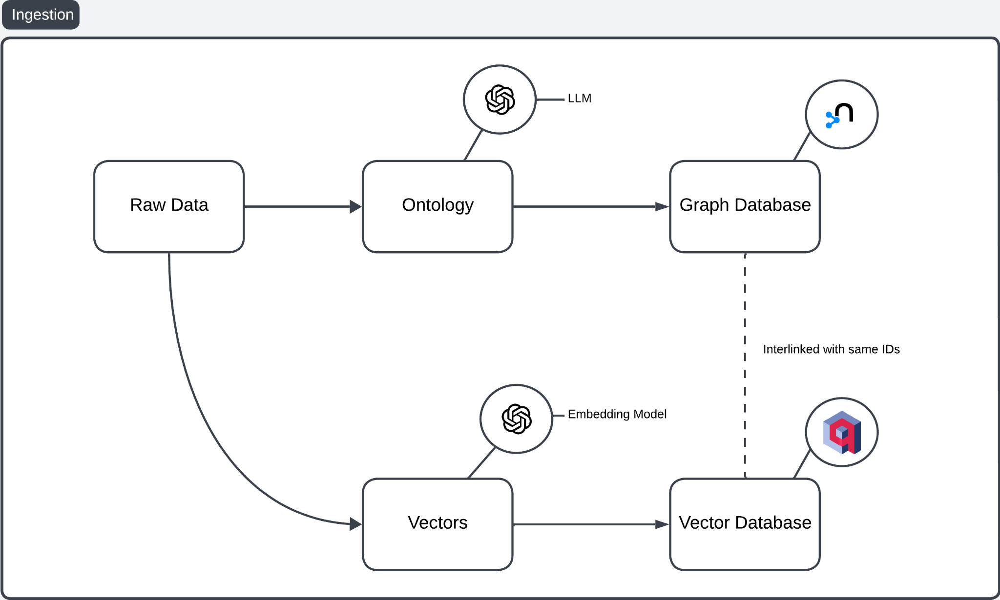
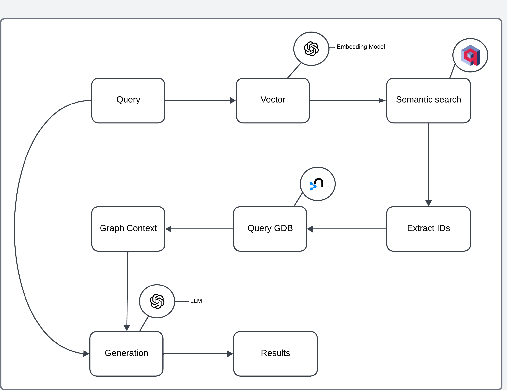

Create the environment **GraphRAG-Agent**:

```shell
# Create and activate the env with conda
conda create --name=GraphRAG-Agent python=3.10 -y && conda activate GraphRAG-Agent && pip install uv

# Install production libs
uv pip install neo4j==5.28.1 neo4j-graphrag==1.7.0 qdrant-client==1.14.2 openai==1.76.0 python-dotenv==1.1.0
```

Remove the **GraphRAG-Agent** environment:
```shell
conda deactivate && conda remove --name=GraphRAG-Agent --all -y
```

LINK TUTORIAL -> https://qdrant.tech/documentation/examples/graphrag-qdrant-neo4j/

## RAG & Its Challenges
RAG combines retrieval-based and generative AI to enhance LLMs with relevant, up-to-date information from a knowledge base, like a vector database. However, RAG faces several challenges:

- **Understanding Context:** Models may misinterpret queries, particularly when the context is complex or ambiguous, leading to incorrect or irrelevant answers.
- **Balancing Similarity vs. Relevance:** RAG systems can struggle to ensure that retrieved information is similar and contextually relevant.
- **Answer Completeness:** Traditional RAGs might not be able to capture all relevant details for complex queries that require LLMs to find relationships in the context that are not explicitly present.

## Introduction to GraphRAG
Unlike RAG, which typically relies on document retrieval, GraphRAG builds knowledge graphs (KGs) to capture entities and their relationships. For datasets or use cases that demand human-level intelligence from an AI system, GraphRAG offers a promising solution:

It can follow chains of relationships to answer complex queries, making it suitable for better reasoning beyond simple document retrieval.
The graph structure allows a deeper understanding of the context, leading to more accurate and relevant responses.  


The workflow of GraphRAG is as follows:

- The LLM analyzes the dataset to identify entities (people, places, organizations) and their relationships, creating a comprehensive knowledge graph where entities are nodes and their connections form edges.
- A bottom-up clustering algorithm organizes the KG into hierarchical semantic groups. This creates meaningful segments of related information, enabling understanding at different levels of abstraction.
- GraphRAG uses both the KG and semantic clusters to select a relevant context for the LLM when answering queries.




## Challenges of GraphRAG

Despite its advantages, the LLM-centric GraphRAG approach faces several challenges:

- **KG Construction with LLMs**: Since the LLM is responsible for constructing the knowledge graph, there are risks such as inconsistencies, propagation of biases or errors, and lack of control over the ontology used. However, we used a LLM to extract the ontology in our implementation.
- **Querying KG with LLMs**: Once the graph is constructed, an LLM translates the human query into Cypher (Neo4j’s declarative query language). However, crafting complex queries in Cypher may result in inaccurate outcomes.
- **Scalability & Cost Consideration**: Relying on LLMs increases costs and decreases scalability, as they are used every time data is added, queried, or generated.

# Architecture Overview

This process is divided into two steps: **Ingestion**, where data is prepared and stored, and **Retrieval and Generation**, where the prepared data is queried and utilized. Let’s start with Ingestion.


## Ingestion

The GraphRAG ingestion pipeline combines a Graph Database and a Vector Database to improve RAG workflows.



Let's break it down:

- Raw Data: unstructured or structured content.
- Ontology Creation: An LLM processes the raw data into an ontology, structuring entities, relationships, and hierarchies. 
- Graph Database: The ontology is stored in a Graph database to capture complex relationships.
- Vector Embeddings: An Embedding model converts the raw data into high-dimensional vectors capturing semantic similarities.
- Vector Database: These embeddings are stored in a Vector database for similarity-based retrieval.
- Database Interlinking: The Graph database (e.g., Neo4j) and Vector database (e.g., Qdrant) share unique IDs, enabling cross-referencing between ontology-based and vector-based results.

## Retrieval & Generation

ID Extraction: Extracted IDs from the semantic search results are used to query the Graph database.



This architecture combines the strengths of both databases:

- **Semantic Search with Vector Database:** The user query is first processed semantically to identify the most relevant data points without needing explicit keyword matches.
- **Contextual Expansion with Graph Database:** IDs or entities retrieved from the vector database query the graph database for detailed relationships, enriching the retrieved data with structured context.
- **Enhanced Generation:** The architecture combines semantic relevance (from the vector database) and graph-based context to enable the LLM to generate more informed, accurate, and contextually rich responses.


```shell
# QDRANT
docker run -p 6333:6333 -p 6334:6334 -v "qdrant_storage:/qdrant/storage:z" qdrant/qdrant

# https://hub.docker.com/_/neo4j
docker run --publish=7474:7474 --publish=7687:7687 --volume=".\neo4j_storage\data:/data" neo4j

Go here http://localhost:7474/

By default, this requires you to login with:
username: neo4j
password: neo4j

and change the password.
```

