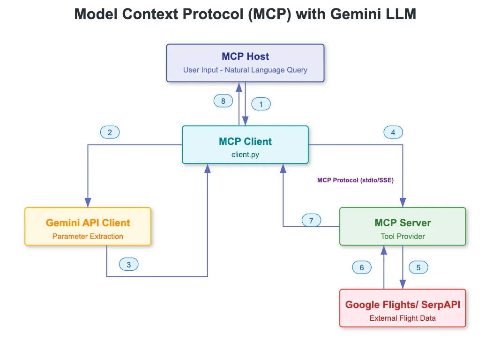
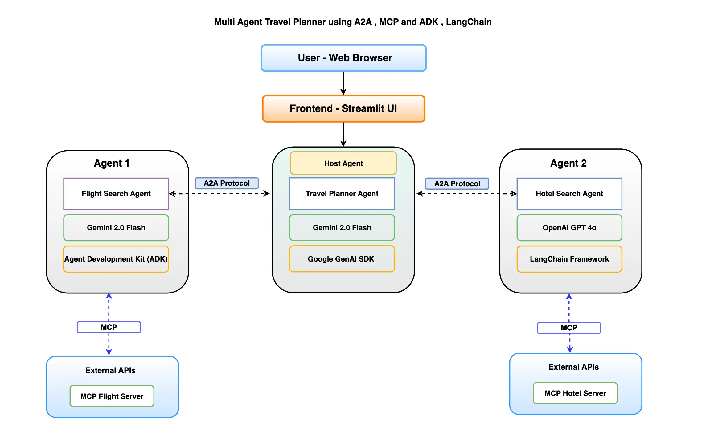

Create the environment **mcp_a2a**:

```shell
# Create and activate the env with conda
conda create --name=mcp_a2a python=3.10 -y && conda activate mcp_a2a && pip install uv

# Install production libs

uv pip install "google-genai==1.12.1" "mcp==1.6.0" "mcp-flight-search==0.2.1"
```

Remove the **mcp_a2a** environment:
```shell
conda deactivate && conda remove --name=mcp_a2a --all -y
```

## **What is Model Context Protocol (MCP) ?**
The Model Context Protocol (MCP) is a standardized, open protocol developed by Anthropic that enables AI models to seamlessly interact with external data sources and tools, acting as a universal connector for AI integrations.

MCP follows a client-server architecture, where:

- Clients (like AI applications or LLMs) connect to
- Servers (MCP tool providers) expose tools, APIs, or data sources to clients.

While Function Calling provides the core capability, the Model Context Protocol (MCP) takes it a step further — making the entire process structured, flexible, and interoperable across a wide range of tools and systems.

**Examples of MCP Servers:**
- File System: Accessing local files and directories.
- Web Search: Run real-time web searches.
- Databases: Query SQL or NoSQL databases
- CRMs: Connecting to CRM systems like Salesforce.
- Version Control: Accessing version control systems like Git



## **What is A2A protocol ?**
A2A (Agent-to-Agent) protocol is an open protocol developed by Google for communication between agents across organizational or technological boundaries.



## **About the project**

You need:
- [serpapi API key](https://serpapi.com/dashboard) (login with okamirvs@gmail.com)

- [Gooke gemini API key](https://aistudio.google.com/) (login with c.umberto95@gmail.com)

We’ll use mcp-flight-search — a lightweight MCP Server built using FastMCP which exposes a tool that searches real-time flight data using the SerpAPI.


INITIALIZE MCP SERVER before running C:\Users\Umberto\git\mcp_a2a\main.py
```python
# Using the command-line entry point
mcp-flight-search --connection_type http
```